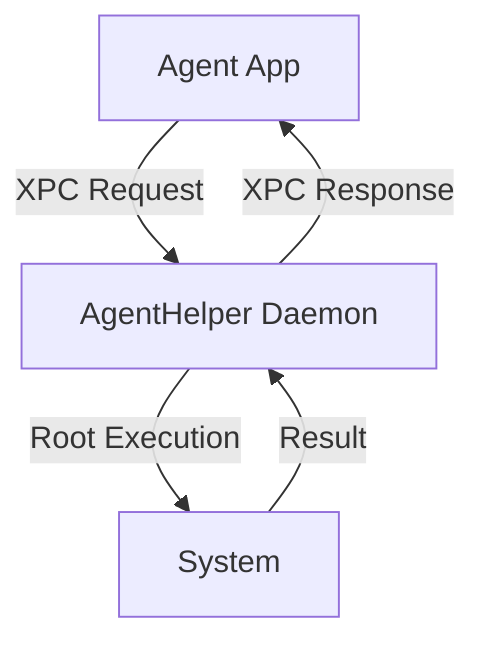

<div align="center">


# 🦾 Agent! for macOS 26

## **Agentic AI for your  Mac Desktop**
## Open Source replacement for Claude Code, Cursor, Open Claw

[](https://github.com/macOS26/Agent/releases/latest)
[](https://github.com/macOS26/Agent/stargazers)
[](https://github.com/macOS26/Agent/fork)
[](https://github.com/apple)
[](https://github.com/apple/swift)
[](LICENSE)

A native macOS AI agent that controls your apps, writes code, automates workflows, and runs tasks from your iPhone via iMessage. All powered by the AI provider of your choice.

</div>

## 🚀 Quick Start

### Prerequisites
- macOS 26.0 or later
- Xcode 16.0 or later
- Swift 6.2

### Installation

1. **Clone the repository:**
```bash
git clone https://github.com/macOS26/Agent.git
cd Agent
```

2. **Open in Xcode:**
```bash
open Agent.xcodeproj
```

3. **Set Development Team:**
- Open project settings
- Set Development Team to `469UCUB275` (or your own team ID)
- Ensure both `Agent` and `AgentHelper` targets are configured

4. **Build and Run:**
```bash
# Using Xcode
xcf build
xcf run

# Or via Xcode UI
```

5. **Grant Privileges:**
- On first launch, macOS will prompt you to approve the privileged helper tool
- This allows Agent! to execute commands as root when needed

## ⚡ Features

### Core Capabilities

- **🤖 Multi-Provider AI Support**: Claude, Ollama, OpenAI-compatible, and Apple Intelligence (Foundation Models)
- **🔐 Privileged Daemon**: Execute commands as root without repeated authentication
- **📦 XPC Communication**: Secure and efficient inter-process communication
- **🛠️ Native Xcode Integration**: Built-in tools for building, running, and managing Xcode projects
- **🌐 Model Context Protocol (MCP)**: Extend functionality with MCP servers for advanced capabilities
- **📝 Task Automation**: Automate workflows and control apps directly from your AI agent
- **📱 iMessage Integration**: Control Agent! from your iPhone

### Built-in Tools

| Category | Tools | Description |
|----------|-------|-------------|
| **Xcode** | `xcode build`, `xcode run`, `xcode list_projects` | Build, run, and manage Xcode projects |
| **File System** | `file_manager`, `git`, `execute_agent_command` | File operations, version control, shell commands |
| **UI Automation** | `accessibility`, `applescript_tool` | Control macOS apps and UI elements |
| **Web** | `web`, `web_search` | Browser automation and web searches |
| **System** | `execute_daemon_command` | Root-level system operations |

## 📚 Architecture

### Project Structure

```
Agent/
├── Agent/                    # Main SwiftUI application
│   ├── AgentApp.swift        # @main entry point
│   ├── ContentView.swift     # Main UI components
│   ├── AgentViewModel.swift  # Core logic and orchestration
│   ├── ClaudeService.swift   # Anthropic Messages API wrapper
│   ├── HelperService.swift   # XPC client + SMAppService
│   └── ...
├── AgentHelper/              # Privileged daemon
│   └── main.swift            # NSXPCListener implementation
└── LaunchDaemons/            # Daemon configuration
    └── Agent.app.toddbruss.helper.plist
```

### Key Components

1. **Agent (Main App)**
   - SwiftUI interface with @Observable ViewModel pattern
   - Task management and execution loop
   - Screenshot capture and clipboard integration
   - Multi-provider AI integration

2. **AgentHelper (Privileged Daemon)**
   - Executes commands as root via NSXPCListener
   - Mach service: `Agent.app.toddbruss.helper`
   - Secure XPC communication with `.privileged` option

3. **Communication Protocol**
   - `HelperToolProtocol`: Command execution and cancellation
   - `HelperProgressProtocol`: Streaming output updates
   - JSON-based message format for tool calls

### XPC Communication Flow



## 🛠️ Configuration

### AI Provider Setup

Configure your preferred AI provider in the app settings:

1. **Claude (Anthropic)**
   - API Key: Required
   - Model: `claude-3-5-sonnet-20240620` (recommended)
   - Features: SSE streaming, native tool calling

2. **Ollama (Local)**
   - Server URL: `http://localhost:11434`
   - Model: `llama3`, `mistral`, etc.
   - Features: Local execution, no API key required

3. **OpenAI-compatible**
   - API Base URL: Your provider endpoint
   - API Key: Required
   - Model: Provider-specific models

4. **Apple Intelligence**
   - Built-in Foundation Models
   - No configuration needed
   - Requires macOS 26+

### MCP Server Configuration

Add MCP servers in `Settings → MCP Servers`:

```json
{
  "mcpServers": {
    "xcode": {
      "command": "xcrun",
      "args": ["mcpbridge"],
      "transport": "stdio"
    },
    "custom": {
      "command": "/path/to/your/server",
      "args": ["--mcp"],
      "transport": "stdio"
    }
  }
}
```

## 📖 Usage Examples

### Basic Commands

```swift
// Execute a shell command
agent.execute("ls -la")

// Build an Xcode project
agent.xcodeBuild()

// Run UI automation
agent.clickButton(title: "OK")
```

### Advanced Workflows

1. **Automated Code Review:**
   ```
   1. Open Xcode project
   2. Run `xcode analyze`
   3. Fix issues automatically
   4. Commit changes to git
   ```

2. **System Diagnostics:**
   ```
   1. Check disk usage with `execute_daemon_command`
   2. Analyze system logs
   3. Generate diagnostic report
   ```

3. **App Automation:**
   ```
   1. Launch target application
   2. Navigate UI with accessibility tools
   3. Extract data
   4. Generate summary report
   ```

## 🔧 Development

### Building from Source

```bash
# Clone repository
git clone https://github.com/macOS26/Agent.git
cd Agent

# Open in Xcode
open Agent.xcodeproj

# Build both targets
xcodebuild -scheme Agent -configuration Release
xcodebuild -scheme AgentHelper -configuration Release

# Run tests
xcodebuild test -scheme Agent
```

### Code Structure

- **View Models**: Follow `@Observable` pattern for state management
- **Services**: Modular design with clear separation of concerns
- **Protocols**: Shared XPC protocols in `HelperProtocol.swift`
- **Error Handling**: Comprehensive `AgentError` enum in `Models.swift`

### Debugging

```bash
# View Xcode logs
Console.app → Filter for "Agent"

# Check daemon status
launchctl list | grep "Agent.app.toddbruss.helper"

# View XPC communication
sudo log stream --predicate 'process == "Agent" OR process == "AgentHelper"'
```

## 🐛 Troubleshooting

### Common Issues

**Issue: Privileged helper fails to install**
- Solution: Check System Preferences → Security & Privacy → Privacy → Full Disk Access
- Ensure Agent! has the necessary permissions

**Issue: XPC connection refused**
- Solution: Verify daemon is running: `launchctl list | grep Agent`
- Restart daemon: `launchctl kickstart -k system/Agent.app.toddbruss.helper`

**Issue: Xcode tools not working**
- Solution: Ensure Xcode is properly installed and selected: `xcode-select --install`
- Grant necessary permissions in System Preferences

### Logs and Diagnostics

```bash
# Application logs
~/Library/Logs/Agent/

# System logs
sudo log show --predicate 'sender == "Agent"' --last 1h

# Daemon logs
sudo log show --predicate 'sender == "AgentHelper"' --last 1h
```

## 🤝 Contributing

We welcome contributions! Please follow these guidelines:

### How to Contribute

1. Fork the repository
2. Create a feature branch: `git checkout -b feature/your-feature`
3. Commit your changes: `git commit -am 'Add some feature'`
4. Push to the branch: `git push origin feature/your-feature`
5. Submit a pull request

### Code Style

- Follow Swift API Design Guidelines
- Use 4-space indentation
- Prefer `let` over `var` where possible
- Document public interfaces with comments
- Keep functions focused and small

### Testing

- Write unit tests for new functionality
- Test with multiple AI providers
- Verify privileged operations work correctly
- Ensure UI remains responsive during long operations

## 📋 Roadmap

### Upcoming Features

- **Enhanced iMessage Integration**: More commands and better error handling
- **Improved Xcode Tools**: Better SwiftUI preview support, documentation search
- **Additional MCP Servers**: More built-in server configurations
- **Performance Optimizations**: Faster tool execution and reduced memory usage
- **UI Improvements**: Dark mode enhancements, better accessibility

### Long-term Goals

- Cross-platform support (iOS, iPadOS)
- Enhanced security features
- Expanded automation capabilities
- Better integration with Apple ecosystem

## 📄 License

MIT - Free and open source. See [LICENSE](LICENSE) for details.

## 🙏 Acknowledgements

- [Anthropic](https://www.anthropic.com) for Claude AI
- [Apple](https://developer.apple.com) for Swift and macOS technologies
- [Model Context Protocol](https://modelcontextprotocol.io) for extensible AI tools
- All contributors and testers who helped make Agent! better

---

<div align="center">

### **Agent! for macOS 26 - Agentic AI for your  Mac Desktop**

🌟 Star us on GitHub and join our community!

</div>