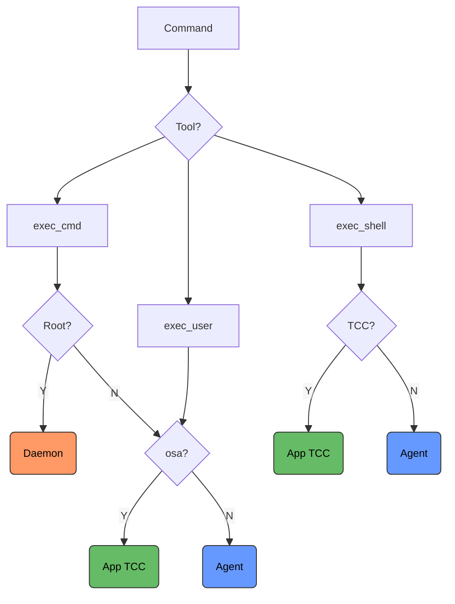

# Agent!
## 🧠 Agentic AI for the  Mac Desktop 
Now with Apple Intelligence

Agent! already have proven to be a Cursor and Claude Code killer in just two weekends. With Agent! you can form a coding plan. Apple Intelligence interprets the plan and passes it to the main LLM. In a few minutes the plan is ready. Agent! asks for plan approval and away you go. You even do this from your iPhone via messages with the "Agent! " prefix

[](https://swift.org)
[](https://macos26.app)
[](https://github.com/macOS26/Agent)
[](https://github.com/macOS26/Agent/releases)
[](https://github.com/macOS26/Agent/stargazers)

Agent! works with Claude API, Ollama Pro/Max Cloud, and local Ollama. Local LLMs need 32-128GB RAM on Apple Silicon.

## What's Supported


### Multi-Provider LLM Support

Agent! supports multiple LLM providers with seamless switching. Configure your preferred provider in Settings. 

OpenAI, DeepSeek, HuggingFace is untested. If you have any issues please file an issue.

| Provider | API Key | Vision | Notes |
|----------|---------|--------|-------|
| **Claude** | Anthropic API key | ✓ | Sonnet 4, Opus 4, Haiku 3.5 |
| **OpenAI** | OpenAI API key | ✓ | GPT-4o, GPT-4 Turbo, GPT-3.5 |
| **DeepSeek** | DeepSeek API key | ✓ | DeepSeek V2, DeepSeek Coder |
| **Hugging Face** | Hugging Face API key | ✓ | Hosted inference API |
| **Ollama Cloud** | Ollama Pro API key | Auto | Cloud-hosted Ollama models |
| **Local Ollama** | None | Auto | Requires 32-128GB RAM on Apple Silicon |

### Apple Intelligence Mediator

Apple Intelligence serves as a **communication mediator** between the LLM and the user, not as an LLM provider. It observes conversations and adds helpful context using on-device intelligence:

| Feature | Description |
|---------|-------------|
| **Error Explanations** | Translates technical errors into user-friendly explanations |
| **Next Step Suggestions** | Suggests logical follow-up actions after task completion |
| **Context Injection** | Clarifies ambiguous user messages for the LLM |
| **Conversation Summaries** | Provides brief summaries of completed tasks |

Annotations are tagged with `[AI]` prefixes to distinguish them from LLM responses:
- `[AI → User]` — User-facing explanations
- `[AI → LLM]` — Context injected into LLM prompts
- `[AI → Both]` — Information for both parties

Enable Apple Intelligence Mediator in Settings to enhance communication clarity. Requires Apple Intelligence-capable Mac running macOS 26+.

**Recent Enhancements:**
- **Timeout Protection**: 10-second timeout prevents LLM tabs from hanging when Apple Intelligence is slow to respond
- **OS Log Diagnostics**: Built-in os.log diagnostics for debugging mediator behavior
- **Brain Button Integration**: Toggle Apple Intelligence mediator directly from the brain button in the toolbar
- **LoRA Training**: Apple Intelligence can also be used for LoRA adapter training with the main LLM

### System Requirements

- **macOS 26+** (Tahoe)
- **Xcode Command Line Tools** (auto-installed if missing)
- **Apple Silicon recommended** for local LLMs

### App Automation (50 apps via ScriptingBridge)

| Category | Apps |
|----------|------|
| **Apple** | Mail, Messages, Music, Photos, Calendar, Contacts, Notes, Reminders, Finder, Safari, Terminal, System Events, System Settings |
| **Productivity** | Pages, Numbers, Keynote, Xcode |
| **Media** | Music, TV, QuickTime Player, Preview |
| **Browsers** | Safari, Chrome, Firefox, Edge |
| **Development** | Xcode, Simulator, Console |

### Accessibility

Full macOS Accessibility API for apps without AppleScript support:
- UI inspection (windows, elements, properties)
- Input simulation (typing, clicking, scrolling, key presses)
- Screenshot capture
- Works with any Mac app

### MCP Servers

| Server | Capability |
|--------|------------|
| **internet-names-mcp** | Domain availability, social handle checks — https://github.com/drewster99/InternetNamesMCP |
| **xcode-mcp-server** | Xcode building, running, screenshots, tests — https://github.com/drewster99/xcode-mcp-server |
| **appstore-mcp-server** | App Store search, rankings, keyword analysis — https://github.com/drewster99/appstore-mcp-server |
| **XCF** | External MCP server — https://xcf.ai |

### AgentScripts

29 bundled Swift scripts for common tasks:
- Email: `CheckMail`, `EmailAccounts`, `OrganizeEmails`
- Media: `NowPlaying`, `PlayPlaylist`, `ExtractAlbumArt`
- Messaging: `SendMessage`, `SendGroupMessage`
- System: `RunningApps`, `QuitApps`, `SystemInfo`
- Web: `Selenium`, `WebForm`, `WebNavigate`, `WebScrape`
- More: `CreateDMG`, `CapturePhoto`, `ListNotes`, `ListReminders`


### Background
Agent! is the result of 27 years of Mac automation experience — from FaceSpan and AppleScript on macOS 9 through AppleScript Studio, AppleScript-ObjC, and now Swift. It connects LLMs to Apple Events, ScriptingBridge, Accessibility APIs, and XPC services for native macOS control.

A native macOS autonomous AI agent built entirely in Swift.

Agent uses SwiftUI, XPC, SMAppService, Apple Events, ScriptingBridge, Accessibility APIs, and MCP to give an AI agent native access to your Mac. It's an `.app` that speaks macOS natively. Xcode command line tools are required which is Agent!'s only dependency.


---

## Table of Contents

- [Getting Started](#getting-started)
- [Security Hardening](#security-hardening)
- [Messages Monitor](#messages-monitor)
- [Accessibility Integration](#accessibility-integration)
- [MCP Servers](#mcp-servers)
- [Architecture](#architecture)
- [Available Tools](#available-tools)
- [AgentScripts](#agentscripts)

- [What Agent! Can Automate](#what-agent-can-automate)
- [Agent! vs. OpenClaw on Mac](#agent-vs-openclaw-on-mac)
- [License](#license)

---

## Getting Started

### 1. Prerequisites

- macOS 26 (Tahoe) or later
- Xcode Command Line Tools (Agent will prompt to install if missing)
- An API key for your preferred provider:
  - **Claude** (Anthropic API key)
  - **OpenAI** (OpenAI API key)
  - **DeepSeek** (DeepSeek API key)
  - **Hugging Face** (Hugging Face API key)
  - **Ollama Pro Cloud** (Ollama API key)
  - **Local Ollama** (no API key required, but requires significant RAM)

### 2. Build and Run

1. Open `Agent.xcodeproj` in Xcode
2. Build and run the **Agent!** target (⌘R)
3. If prompted, install Xcode Command Line Tools via the system check overlay

### 3. Register Background Services

Click the **Register** button in the toolbar to install the background services:

This registers two background services using Apple's SMAppService framework:

1. **User Agent** (`Agent.app.toddbruss.user`) — Runs commands as your user account
2. **Privileged Daemon** (`Agent.app.toddbruss.helper`) — Runs commands as root when needed

### 4. Approve in System Settings

After clicking Register, macOS will prompt you to approve the background services:

1. **System Settings** → **General** → **Login Items**
2. Allow both **Agent** and **AgentHelper** (you may see two prompts)

The privileged daemon requires explicit approval because it runs with root privileges. Agent follows Apple's recommended XPC + SMAppService pattern for secure privilege separation.

### 5. Configure Your Provider

Click the **gear icon** (⚙️) to open Settings:

#### Claude API
1. Select **Claude** from the provider picker
2. Enter your Anthropic API key (starts with `sk-ant-...`)
3. Select a model (Sonnet 4, Opus 4, or Haiku 3.5)

#### OpenAI API
1. Select **OpenAI** from the provider picker
2. Enter your OpenAI API key (starts with `sk-proj-...`)
3. Select a model (GPT-4o, GPT-4 Turbo, or GPT-3.5)

#### DeepSeek API
1. Select **DeepSeek** from the provider picker
2. Enter your DeepSeek API key
3. Select a model (DeepSeek V2 or DeepSeek Coder)

#### Hugging Face API
1. Select **Hugging Face** from the provider picker
2. Enter your Hugging Face API key
3. Enter the model ID (e.g., `mistralai/Mistral-7B-Instruct-v0.3`)

#### Ollama Pro Cloud
1. Select **Ollama Cloud** from the provider picker
2. Enter your Ollama Pro API key
3. Select or type a model name
4. Click the refresh button to fetch available models

#### Local Ollama
1. Select **Local Ollama** from the provider picker
2. Enter your Ollama endpoint (default: `http://localhost:11434/api/chat`)
3. Ensure you have a local Ollama instance running with at least one model pulled
4. Click the refresh button to fetch available models

> **Note:** Local Ollama requires significant RAM (minimum 32GB, recommended 64-128GB). For Mac minis or devices with limited RAM, cloud-based LLMs are strongly recommended.

### 6. Set a Project Folder (optional)

Click the **folder icon** in the toolbar to select a project folder or file. This sets a default working directory that the AI uses as context for all commands and file operations. The project folder is included in the system prompt on every API call, so the AI always knows your workspace context — even across multi-step tasks. You can change it at any time between tasks.

The AI is not restricted to this folder — it can look outside it when needed to complete a task.

### 7. Connect and Run

1. Click **Connect** to test the XPC services
2. Type a task in natural language
3. Press **Run** (or ⌘Enter)

Agent will autonomously execute your task using the appropriate tools.

---

## Security Hardening

Agent! implements a comprehensive security model based on Apple's recommended patterns:

### Dual Privilege Model

Agent runs two XPC services registered through Apple's SMAppService:

| Service | Identifier | Runs As | Purpose |
|---------|------------|---------|---------|
| **User Agent** | `Agent.app.toddbruss.user` | User account | File editing, git, builds, scripts |
| **Privileged Daemon** | `Agent.app.toddbruss.helper` | Root (via LaunchDaemon) | System packages, /Library, launchd, disk operations |

The AI defaults to **user-level execution** and only uses the privileged daemon when explicitly required for system-level operations. This follows the principle of least privilege.

### Managing Background Services

Both services can be toggled on/off from the Agent UI:

| Service | UI Control | Behavior When Disabled |
|---------|------------|------------------------|
| **User Agent** | "User" toggle in header | Agent process killed, LaunchAgent unregistered from SMAppService |
| **Privileged Daemon** | "Daemon" toggle in header | Daemon process killed, LaunchDaemon unregistered from SMAppService |

**To re-enable a disabled service:**
1. Toggle it back on in the UI
2. Click **Connect** to test connectivity
3. Click **Register** to re-register with SMAppService
4. Approve in System Settings if prompted

**Use cases for disabling:**
- Troubleshooting XPC communication issues
- Temporarily preventing background operations
- Security hardening (disable daemon when not needed)
- Development/testing without background services

The toggle state persists across app launches via UserDefaults.

### XPC Sandboxing

All privileged operations go through XPC (Inter-Process Communication):

```
Agent.app (SwiftUI)
    |
    |-- UserService (XPC) → Agent.app.toddbruss.user    (LaunchAgent, runs as user)
    |-- HelperService (XPC) → Agent.app.toddbruss.helper  (LaunchDaemon, runs as root)
```

The XPC boundary ensures:
- The main app runs with minimal privileges
- Root operations are isolated to the daemon
- Each XPC call is a discrete, auditable transaction
- File permissions are restored to the user after root operations

### Entitlements

Agent's entitlements (`Agent.entitlements`):

| Entitlement | Purpose |
|-------------|---------|
| `automation.apple-events` | AppleScript and ScriptingBridge automation |
| `cs.allow-unsigned-executable-memory` | Required for dlopen'd AgentScript dylibs |
| `cs.disable-library-validation` | Load user-compiled script dylibs at runtime |
| `assets.music.read-write` | Music library access via MusicBridge |
| `device.audio-input` | Microphone access for audio scripts |
| `device.bluetooth` | Bluetooth device interaction |
| `device.camera` | Camera capture (CapturePhoto script) |
| `device.usb` | USB device access |
| `files.downloads.read-write` | Read/write Downloads folder |
| `files.user-selected.read-write` | Read/write user-selected files |
| `network.client` | Outbound connections (API calls, web search) |
| `network.server` | Inbound connections (MCP HTTP/SSE transport) |
| `personal-information.addressbook` | Contacts access via ContactsBridge |
| `personal-information.calendars` | Calendar access via CalendarBridge |
| `personal-information.location` | Location services |
| `personal-information.photos-library` | Photos access via PhotosBridge |
| `keychain-access-groups` | Secure API key storage |

### TCC Permissions (Accessibility, Screen Recording, Automation)

Protected macOS APIs require user approval. Agent handles this correctly:

| Component | How it inherits TCC permissions |
|-----------|--------------------------------|
| `run_agent_script` (dylib) | Loaded into Agent app process — inherits ALL TCC grants |
| `apple_event_query` | Runs in Agent app process — inherits Automation permissions |
| `execute_shell_command` (TCC) | osascript/screencapture run in Agent app process — inherits ALL TCC grants |
| `execute_shell_command` (non-TCC) | Routes through UserService LaunchAgent — does NOT inherit TCC grants |
| `execute_user_command` | LaunchAgent process — does NOT inherit TCC grants |
| `execute_command` (root) | LaunchDaemon process — has separate TCC context |

**Rule:** For Accessibility, Screen Recording, or Automation tasks, always use `run_agent_script` or `apple_event_query`. Do NOT use shell commands for these operations.

### Write Protection

- `apple_event_query` blocks destructive operations (`delete`, `close`, `move`, `quit`) by default
- The AI must explicitly set `allow_writes: true` to permit them
- This prevents accidental data loss from misinterpreted commands


---

## Messages Monitor

Agent! includes a built-in **Apple Messages monitor** that lets you control your Mac remotely via iMessage. Send a text message starting with `Agent!` from any approved contact and Agent will execute it as a task — then reply with the result.

### Dedicated Messages Tab

Agent! now features a dedicated **Messages tab** (green) specifically for iMessage Agent! commands. This tab:
- Uses the main LLM for processing (not a separate model)
- Provides a focused interface for remote command execution
- Shows real-time message monitoring status
- Integrates seamlessly with the Messages Monitor popover

### How It Works

1. Toggle **Messages** ON in the toolbar (green switch next to "Messages")
2. Click the **speech bubble icon** to open the Messages Monitor popover
3. Send a message starting with `Agent!` from another device or contact (e.g., `Agent! Next Song`)
4. The sender's handle (phone number or email) appears in the recipients list
5. Toggle the recipient ON to approve them
6. Future `Agent!` messages from approved recipients will automatically run as tasks
7. When the task completes, Agent sends the result (up to 256 characters) back via iMessage

### Message Format

```
Agent! <your prompt here>
```

Examples:
- `Agent! What song is playing?`
- `Agent! Next Song`
- `Agent! Check my email`
- `Agent! Build and run my Xcode project`

### Message Filter

The filter picker controls which messages are monitored:

| Filter | Description |
|--------|-------------|
| **From Others** | Only incoming messages from other people (default) |
| **From Me** | Only your own sent messages (useful for self-testing between your devices) |
| **Both** | All messages regardless of sender |

### Recipient Approval

Every recipient must be explicitly approved before their `Agent!` commands trigger tasks:

- Recipients are auto-discovered when they send an `Agent!` message
- Unapproved messages are logged with a "not approved" note but not acted on
- Use **All** / **None** buttons to bulk-toggle recipients within the current filter
- Use **Clear** to remove all discovered recipients and start fresh

### How It Reads Messages

Agent reads the macOS Messages database (`~/Library/Messages/chat.db`) directly using the SQLite3 C API. It polls every 5 seconds for new messages. The `attributedBody` blob is decoded using the Objective-C runtime for messages where the `text` column is NULL (common with iMessage).

No external dependencies. No network requests. Everything runs locally on your Mac.

---

## Accessibility Integration

Agent! includes a full macOS Accessibility API integration that gives the AI the ability to see, inspect, and interact with any application's UI. This enables automation of apps that don't support AppleScript or ScriptingBridge.

### Permissions

Accessibility requires explicit user approval in **System Settings > Privacy & Security > Accessibility**. Agent provides tools to manage this:

- `ax_check_permission` — Check if Accessibility access is granted
- `ax_request_permission` — Trigger the macOS permission prompt

### Available Tools (22 tools)

#### Read-Only Inspection

| Tool | Description |
|------|-------------|
| `ax_list_windows` | List all visible windows with positions, sizes, and owner apps |
| `ax_inspect_element` | Inspect the accessibility element at a screen coordinate (role, title, value, children) |
| `ax_get_properties` | Get all properties of an element found by role, title, value, app bundle ID, or position. Use SAME role/title/value from ax_wait_for_element to locate. |
| `ax_get_children` | Get all children of an accessibility element. Use SAME role/title/value from ax_wait_for_element or ax_find_element to locate the parent. |
| `ax_get_focused_element` | Get the currently focused accessibility element |
| `ax_screenshot` | Capture a screenshot of a region or specific window |
| `ax_get_audit_log` | View recent accessibility operations (all actions are audit-logged) |

#### Input Simulation

| Tool | Description |
|------|-------------|
| `ax_type_text` | Simulate keyboard typing at the current cursor or specific coordinates |
| `ax_click` | Simulate mouse clicks (left/right/middle, single/double) at screen coordinates |
| `ax_scroll` | Simulate scroll wheel at screen coordinates |
| `ax_press_key` | Simulate key presses with modifiers (Cmd+C, Option+Tab, etc.) |
| `ax_drag` | Perform a drag operation from one point to another |

#### UI Interaction

| Tool | Description |
|------|-------------|
| `ax_perform_action` | Perform an accessibility action (AXPress, AXConfirm, etc.) on a UI element. Use SAME role/title/value from ax_wait_for_element or ax_find_element to locate the element. |
| `ax_set_properties` | Set accessibility property values on an element (e.g., text fields, sliders, selections) |
| `ax_show_menu` | Show context menu for an element (simulates right-click at element center) |

#### Smart Automation

| Tool | Description |
|------|-------------|
| `ax_find_element` | Find an accessibility element by role, title, or value with optional timeout |
| `ax_wait_for_element` | Wait for an accessibility element to appear (polling until found or timeout) |
| `ax_wait_adaptive` | Wait for an element with exponential backoff polling (efficient for slow-loading content) |
| `ax_click_element` | Click an element by finding it semantically (role/title) and clicking its center |
| `ax_type_into_element` | Type text into an element found by role/title (tries AXValue set first, falls back to CGEvent typing) |

### Security Safeguards

- **Protected roles/actions can be disabled by user** — Password fields (`AXSecureTextField`, `AXPasswordField`) and interactive actions (`AXPress`, `AXConfirm`, etc.) are in a protected list. All default to ENABLED. User can disable per-item in Accessibility Settings. When disabled, password fields are always blocked; actions are blocked entirely.
- **Interactive actions default to enabled** — `ax_perform_action` defaults to `allowWrites=true`. Set `allowWrites=false` only when you need to disable actions that are enabled in Accessibility Settings.
- **Audit logging** — Every accessibility operation is logged with timestamps to `~/Documents/Agent/accessibility_audit.log`
- **TCC boundary** — Accessibility tools only work when run in the Agent app process (via `run_agent_script` or directly). Shell commands via `execute_user_command` do NOT inherit Accessibility permissions.

### Implementation

Built on Apple's native AXUIElement C API and CGEvent framework:

- `AXUIElementCopyElementAtPosition` for coordinate-based element discovery
- `AXUIElementCopyAttributeValue` for reading element properties (role, title, value, children, position, size)
- `AXUIElementPerformAction` for triggering UI actions
- `CGEvent` for keyboard and mouse simulation
- `CGWindowListCopyWindowInfo` for window enumeration

All code lives in `AccessibilityService.swift` as a self-contained service with no external dependencies.

---

## MCP Servers

Agent! supports **MCP (Model Context Protocol)** servers for extended functionality.

### Available MCP Servers

- **internet-names-mcp** — Domain and social handle availability — https://github.com/drewster99/InternetNamesMCP
- **xcode-mcp-server** — Xcode project building, running, screenshots — https://github.com/drewster99/xcode-mcp-server
- **appstore-mcp-server** — App Store search, rankings, keywords — https://github.com/drewster99/appstore-mcp-server
- **XCF** — External MCP server — https://xcf.ai

### Adding MCP Servers

1. Click the **server icon** in toolbar → **+** to add
2. Configure: Name, Command, Arguments, Environment, Transport (stdio/HTTP/SSE)
3. Enable **Auto-start** to connect on launch

---

### How MCP Tools Work

When connected to an MCP server, Agent:

1. Discovers available tools from the server
2. Adds tools to its tool registry
3. Uses them autonomously based on user requests
4. Returns results through the same MCP protocol

### Transport

- **stdio** — Standard input/output pipes (most common)
- **HTTP/SSE** — Streamable HTTP and Server-Sent Events

### Tool Management

- Enable/disable individual tools per server
- View tool descriptions and input schemas
- See connection status and errors in real-time

---

## Architecture

```
Agent.app (SwiftUI)
  |
  |-- AgentViewModel         Orchestrates task loop, screenshots, clipboard, project folder
  |-- ClaudeService          Anthropic Messages API (streaming), project folder in system prompt
  |-- OllamaService          Ollama native API (OpenAI-compatible), project folder in system prompt
  |-- ChatHistoryStore       SwiftData-backed task memory with summaries for older tasks
  |-- CodingService          File read/write/edit/search operations for LLM tools
  |-- MCPService             MCP client for external tool servers
  |-- ScriptService          Swift Package manager for agent scripts
  |-- XcodeService           ScriptingBridge automation for Xcode
  |-- AppleEventService      Dynamic Apple Event queries (zero compilation)
  |-- AccessibilityService   AXUIElement API for UI automation
  |-- Messages Monitor       Polls chat.db for iMessage remote control
  |-- DependencyChecker      Xcode CLT detection + install trigger
  |
  |-- [In-Process]           TCC commands run directly in the app (inherits ALL TCC grants)
  |-- UserService (XPC) --> Agent.app.toddbruss.user    (LaunchAgent, runs as user)
  |-- HelperService (XPC) --> Agent.app.toddbruss.helper (LaunchDaemon, runs as root)

~/Documents/Agent/agents/   (Swift Package — scripts + bridges)
  |
  |-- Package.swift          Declares all bridge and script targets
  |-- Sources/Scripts/       One .swift file per executable script
  |-- Sources/XCFScriptingBridges/  One .swift file per app bridge + Common
```

### Command Routing

Every shell command follows one of three execution paths based on privilege needs and TCC requirements:



| Path | Service | Runs As | TCC | Used For |
|------|---------|---------|-----|----------|
| **In-Process** | Agent.app directly | User | ALL (Automation, Accessibility, Screen Recording) | osascript, screencapture, TCC-dependent commands |
| **UserService XPC** | `Agent.app.toddbruss.user` (LaunchAgent) | User | None | git, find, grep, builds, file ops, homebrew |
| **HelperService XPC** | `Agent.app.toddbruss.helper` (LaunchDaemon) | Root | None | System packages, /System, /Library, disk operations |

### App Automation Priority

The AI follows this priority order when automating Mac applications:

| Priority | Tool | When to Use |
|----------|------|-------------|
| 1 | `apple_event_query` | First choice for reading app data — instant ObjC dispatch, zero compilation |
| 2 | `execute_shell_command` | osascript with TCC — quick one-off AppleScript commands |
| 3 | Accessibility tools (`ax_*`) | AXUIElement API for UI inspection and interaction |
| 4 | `run_agent_script` | ScriptingBridge Swift dylib for complex/persistent automation (full TCC) |
| 5 | NSAppleScript inside `run_agent_script` | Fallback when ScriptingBridge has issues with an app |

---

## Available Tools

Agent! provides **100+ tools** across multiple categories for autonomous task execution.

### Diff Tools (2 tools)

| Tool | Description |
|------|-------------|
| `create_diff` | Compare two text strings and return a pretty D1F diff with emoji markers (📎 retain, ❌ delete, ✅ insert) |
| `apply_diff` | Apply a D1F ASCII diff to a file for precise multi-line edits |

### File Operations (7 tools)

| Tool | Description |
|------|-------------|
| `read_file` | Read file contents with line numbers |
| `write_file` | Create or overwrite a file |
| `edit_file` | Replace exact text in a file (shows D1F diff preview) |
| `create_diff` | Compare two text strings and return a pretty D1F diff |
| `apply_diff` | Apply a D1F ASCII diff to a file |
| `list_files` | Find files matching a glob pattern |
| `search_files` | Search file contents by regex pattern |

### Git Operations (6 tools)

| Tool | Description |
|------|-------------|
| `git_status` | Show current branch, staged/unstaged changes |
| `git_diff` | Show file changes as unified diff |
| `git_log` | Show recent commit history |
| `git_commit` | Stage files and create a commit |
| `git_diff_patch` | Apply a unified diff patch |
| `git_branch` | Create a new git branch |

### Command Execution (3 tools)

| Tool | Description |
|------|-------------|
| `execute_agent_command` | Execute as current user (no TCC) — for git, builds, file ops, CLI tools |
| `execute_daemon_command` | Execute as ROOT via LaunchDaemon (no TCC) — for system packages, /Library |
| `execute_shell_command` | Smart routing: TCC commands in-process, others via UserService |

### Apple Event Query (1 tool)

| Tool | Description |
|------|-------------|
| `apple_event_query` | Query scriptable apps dynamically (zero compilation) |
| `lookup_sdef` | Read app scripting dictionary before writing AppleScript |

### Accessibility Tools (22 tools)

| Tool | Description |
|------|-------------|
| `ax_list_windows` | List visible windows |
| `ax_inspect_element` | Inspect element at coordinates |
| `ax_get_properties` | Get element properties |
| `ax_get_children` | Get element children |
| `ax_get_focused_element` | Get focused element |
| `ax_find_element` | Find element by role/title/value |
| `ax_wait_for_element` | Wait for element to appear |
| `ax_wait_adaptive` | Wait with exponential backoff |
| `ax_type_text` | Simulate typing |
| `ax_click` | Simulate mouse click |
| `ax_scroll` | Simulate scroll wheel |
| `ax_press_key` | Simulate key press with modifiers |
| `ax_drag` | Perform drag operation |
| `ax_perform_action` | Perform accessibility action |
| `ax_set_properties` | Set element properties |
| `ax_click_element` | Click element by role/title |
| `ax_type_into_element` | Type into element by role/title |
| `ax_show_menu` | Show context menu |
| `ax_screenshot` | Capture screenshot |
| `ax_check_permission` | Check Accessibility permission |
| `ax_request_permission` | Request Accessibility permission |
| `ax_get_audit_log` | View accessibility audit log |

### Saved Scripts (8 tools)

| Tool | Description |
|------|-------------|
| `list_apple_scripts` | List saved AppleScripts |
| `run_apple_script` | Run saved AppleScript |
| `save_apple_script` | Save AppleScript for reuse |
| `delete_apple_script` | Delete saved AppleScript |
| `list_javascript` | List saved JXA scripts |
| `run_javascript` | Run saved JXA script |
| `save_javascript` | Save JXA for reuse |
| `delete_javascript` | Delete saved JXA |

### AgentScripts (6 tools)

| Tool | Description |
|------|-------------|
| `list_agent_scripts` | List all Swift automation scripts |
| `read_agent_script` | Read source code of a script |
| `create_agent_script` | Create a new Swift script |
| `update_agent_script` | Update an existing script |
| `run_agent_script` | Compile and run a Swift dylib script |
| `delete_agent_script` | Delete a script |

### Xcode Automation (5 tools)

| Tool | Description |
|------|-------------|
| `xcode_build` | Build an Xcode project/workspace |
| `xcode_run` | Build and run an Xcode project |
| `xcode_list_projects` | List all open Xcode projects |
| `xcode_select_project` | Select a project by number |
| `xcode_grant_permission` | Grant macOS Automation permission for Xcode |

### Web Automation (7 tools)

| Tool | Description |
|------|-------------|
| `web_open` | Open a URL in Safari, Chrome, Firefox, or Edge |
| `web_find` | Find element on page (auto-selects: AX → JS → Selenium) |
| `web_click` | Click element by selector |
| `web_type` | Type text into input field |
| `web_execute_js` | Execute JavaScript in browser |
| `web_get_url` | Get current URL from browser |
| `web_get_title` | Get page title from browser |

### Selenium WebDriver (8 tools)

| Tool | Description |
|------|-------------|
| `selenium_start` | Start WebDriver session (Safari built-in, Chrome/Firefox need drivers) |
| `selenium_stop` | End WebDriver session |
| `selenium_navigate` | Navigate to URL |
| `selenium_find` | Find element by CSS/XPath/id/name |
| `selenium_click` | Click element |
| `selenium_type` | Type text into element |
| `selenium_execute` | Execute JavaScript |
| `selenium_screenshot` | Take screenshot |
| `selenium_wait` | Wait for element to appear |

### Task Management (1 tool)

| Tool | Description |
|------|-------------|
| `task_complete` | Signal that a task has been completed |

### MCP Tools

Agent! supports MCP (Model Context Protocol) servers. Currently configured servers include:

- **internet-names-mcp** — Domain and social handle availability — https://github.com/drewster99/InternetNamesMCP
- **xcode-mcp-server** — Xcode project building, running, screenshots — https://github.com/drewster99/xcode-mcp-server
- **appstore-mcp-server** — App Store search, rankings, keywords — https://github.com/drewster99/appstore-mcp-server
- **XCF** — External MCP server — https://xcf.ai

---

## AgentScripts

Agent! includes a built-in Swift scripting system. Scripts live in `~/Documents/Agent/agents/` as a Swift Package:

```
~/Documents/Agent/agents/
├── Package.swift
└── Sources/
    ├── Scripts/           ← one .swift file per script
    │   ├── CheckMail.swift
    │   ├── Hello.swift
    │   └── ...
    └── XCFScriptingBridges/  ← one .swift file per app bridge
        ├── ScriptingBridgeCommon.swift
        ├── MailBridge.swift
        └── ...
```

### Core Scripts (bundled)

29 scripts come pre-compiled in Agent.app/Contents/Resources/:

| Script | Description |
|--------|-------------|
| `AccessibilityRecorder` | Record accessibility actions |
| `AXDemo` | Accessibility API demonstration |
| `CapturePhoto` | Capture photo from camera |
| `CheckMail` | Check for new email messages |
| `CreateDMG` | Create a DMG disk image |
| `EmailAccounts` | List email accounts |
| `ExtractAlbumArt` | Extract album artwork from Music |
| `GenerateBridge` | Generate ScriptingBridge for any app |
| `Hello` | Simple hello world script |
| `ListHomeContents` | List home directory contents |
| `ListNotes` | List Apple Notes |
| `ListReminders` | List Reminders |
| `MusicScriptingExamples` | Music app scripting examples |
| `NowPlaying` | Get currently playing track |
| `NowPlayingHTML` | Now playing info as HTML |
| `OrganizeEmails` | Organize email into folders |
| `PlayPlaylist` | Play a Music playlist |
| `PlayRandomFromCurrent` | Play random track from current playlist |
| `QuitApps` | Quit running applications |
| `RunningApps` | List running applications |
| `SDEFtoJSON` | Convert SDEF to JSON |
| `SafariSearch` | Search in Safari |
| `SaveImageFromClipboard` | Save image from clipboard |
| `Selenium` | WebDriver automation |
| `SendGroupMessage` | Send group iMessage |
| `SendMessage` | Send iMessage |
| `SystemInfo` | Get system information |
| `TodayEvents` | Get today's calendar events |
| `WebForm` | Web form automation |
| `WebNavigate` | Web navigation |
| `WebScrape` | Web scraping |

The AI can create, read, update, delete, compile, and run these scripts autonomously:

- `list_agent_scripts` — list all scripts
- `create_agent_script` — write a new script
- `read_agent_script` — read source code
- `update_agent_script` — modify an existing script
- `run_agent_script` — compile with `swift build --product <name>` and execute
- `delete_agent_script` — remove a script

### D1F Diff Integration

Agent includes the **D1F (Diff 1 Format)** package integrated as a local dependency for pretty diff output:

- **create_diff** — Compare two text strings and get a visual diff with emoji markers:
  - 📎 Retained lines (unchanged)
  - ❌ Deleted lines (removed)
  - ✅ Inserted lines (added)
- **apply_diff** — Apply D1F ASCII diffs directly to files
- **edit_file** — Shows D1F diff preview when replacing text

The D1F package lives in the project folder as a local Swift package dependency, enabling clear visual diffs for file edits without external dependencies.

### Dynamic Apple Event Queries

Agent includes an `apple_event_query` tool that lets the AI query any scriptable Mac app **instantly — with zero compilation**. It uses Objective-C dynamic dispatch to walk an app's Apple Event object graph at runtime.

| Operation | Description | Example |
|-----------|-------------|---------|
| `get` | Access a property | `{action: "get", key: "currentTrack"}` |
| `iterate` | Read properties from array items | `{action: "iterate", properties: ["name", "artist"], limit: 10}` |
| `index` | Pick one item from array | `{action: "index", index: 0}` |
| `call` | Invoke a method | `{action: "call", method: "playpause"}` |
| `filter` | NSPredicate filter | `{action: "filter", predicate: "name contains 'inbox'"}` |

### ScriptingBridges Library

Agent ships with pre-generated Swift protocol definitions for **50 macOS applications**:

| Category | Applications |
|----------|--------------|
| **Apple Apps** | Automator, Calendar, Contacts, Finder, Mail, Messages, Music, Notes, Numbers, Pages, Photos, Preview, QuickTime Player, Reminders, Safari, Script Editor, Shortcuts, System Events, Terminal, TextEdit, TV |
| **Developer Tools** | Xcode, Developer Tools, Instruments, Simulator |
| **Creative Apps** | Keynote, Logic Pro, Final Cut Pro, Adobe Illustrator, Pixelmator Pro |
| **Browsers** | Google Chrome, Firefox, Microsoft Edge |
| **System** | System Settings, System Information, Screen Sharing, Bluetooth File Exchange, Console, Database Events, Folder Actions Setup, Voice Over, UTM |
| **Legacy** | Pages Creator Studio, Numbers Creator Studio, Logic Pro Creator Studio, Final Cut Pro Creator Studio |

Each bridge is its own Swift module. Scripts import only what they need (e.g. `import MailBridge`), keeping builds fast and isolated.

### Streaming & Markdown

Agent streams responses token-by-token in real time. The activity log renders markdown inline: **bold**, *italic*, `inline code`, and fenced code blocks with syntax highlighting.

### Vision: Screenshot and Clipboard Support

Attach screenshots or paste images directly into Agent. Images are encoded as base64 PNG and sent as vision content blocks. The AI can see what's on your screen and act on it.

### Task Memory

Agent persists task history using SwiftData. Recent task messages and older task summaries are injected into the system prompt, giving the AI memory across sessions.

---

## Agent! vs. OpenClaw on Mac

| | **Agent!** | **OpenClaw** |
|---|---|---|
| **Focus** | macOS-native depth | Cross-platform breadth |
| **Runtime** | Native Swift binary | Node.js server |
| **UI** | SwiftUI app | Web chat / Telegram / CLI |
| **Privilege model** | XPC + Launch Daemon (Apple's official pattern) | Shell commands |
| **macOS integration** | Apple Events, ScriptingBridge, AppleScript, SMAppService, Accessibility | Generic shell access |
| **Xcode automation** | Built-in: build, run, grant permissions | N/A |
| **Accessibility** | Full AXUIElement API integration | Limited |
| **Scripting language** | Swift Package-based AgentScripts | Python/JS scripts |
| **MCP support** | Yes (stdio, HTTP/SSE) | Yes |
| **Messaging** | Native Apple Messages (iMessage/SMS) with per-recipient approval | WhatsApp, Telegram, Slack, Discord, iMessage, and more |
| **Message reply** | Auto-replies task results via iMessage to approved senders | Platform-specific replies |
| **App size** | ~13 MB | ~90.5 MB unpacked (npm) |
| **Installation** | Run the .app, install Xcode Command Line Tools (`xcode-select --install`) | `openclaw onboard` wizard |
| **Dependencies** | Xcode Command Line Tools | Node.js + npm ecosystem |
| **Apple Silicon** | Native ARM64 | Interpreted (Node.js) |

Both tools have their strengths. If you want a personal assistant across every messaging platform, OpenClaw is excellent. If you want an AI agent that reads Apple Messages natively, drives Xcode, compiles Swift, controls Mac apps through ScriptingBridge, and escalates to root through a proper Launch Daemon — Agent is built for that.

---

## License

MIT
