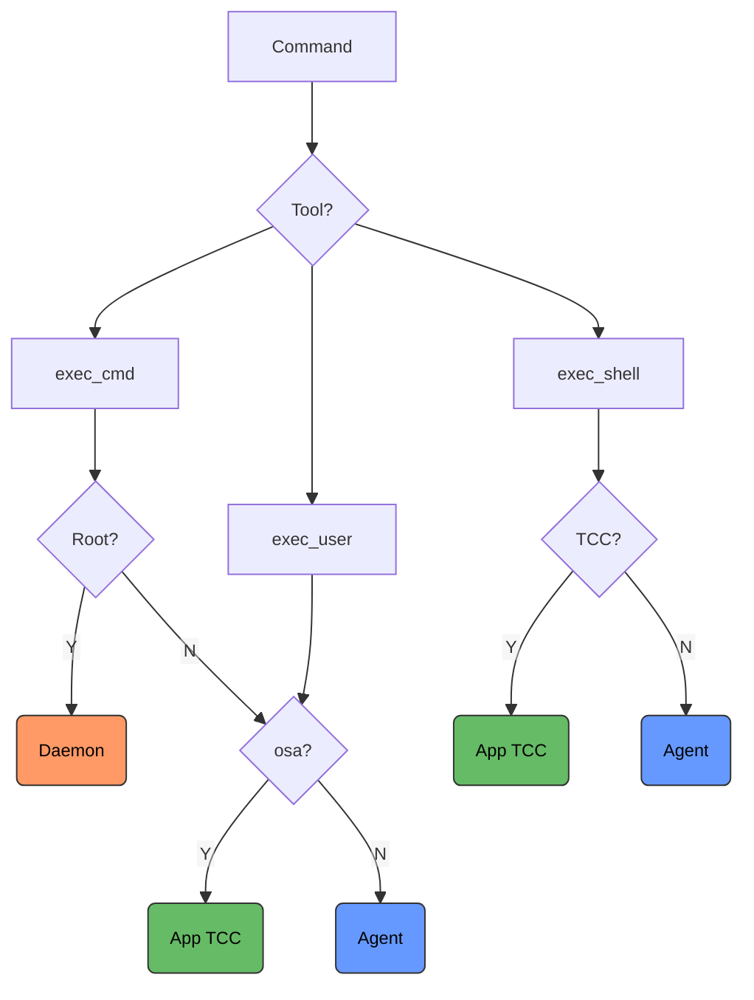

# Agent!

[](https://swift.org)
[](https://macos26.app)
[](https://github.com/macOS26/Agent)
[](https://github.com/macOS26/Agent/releases)
[](https://github.com/macOS26/Agent/stargazers)

### Dream Big with true Agentic AI for your entire  Mac Desktop 🤯
Agent! is designed for Ollama Pro API or Max $20, $100/mo https://ollama.com/pricing
Claude API and Local Ollama LLMs are fully supported. Recommend 32GB - 128GB for local LLMs on Apple Silcon. Apple Intelligence is extremely experimental.


A native macOS autonomous AI agent built entirely in Swift.

Agent uses SwiftUI, XPC, SMAppService, Apple Events, ScriptingBridge, Accessibility APIs, and MCP to give an AI agent native access to your Mac. It's an `.app` that speaks macOS natively. Xcode command line tools are required which is Agent!'s only dependency.


---

## Table of Contents

- [Getting Started](#getting-started)
  - [1. Prerequisites](#1-prerequisites)
  - [2. Build and Run](#2-build-and-run)
  - [3. Register Background Services](#3-register-background-services)
  - [4. Approve in System Settings](#4-approve-in-system-settings)
  - [5. Configure Your Provider](#5-configure-your-provider)
  - [6. Set a Project Folder (optional)](#6-set-a-project-folder-optional)
  - [7. Connect and Run](#7-connect-and-run)
- [Security Hardening](#security-hardening)
  - [Dual Privilege Model](#dual-privilege-model)
  - [XPC Sandboxing](#xpc-sandboxing)
  - [Entitlements](#entitlements)
  - [TCC Permissions](#tcc-permissions-accessibility-screen-recording-automation)
  - [Write Protection](#write-protection)
  - [Root Escalation Audit Trail](#root-escalation-audit-trail)
- [Messages Monitor](#messages-monitor)
  - [How It Works](#how-it-works)
  - [Message Format](#message-format)
  - [Message Filter](#message-filter)
  - [Recipient Approval](#recipient-approval)
  - [How It Reads Messages](#how-it-reads-messages)
- [Accessibility Integration](#accessibility-integration)
  - [Permissions](#permissions)
  - [Available Tools (12 total)](#available-tools-12-total)
  - [Security Safeguards](#security-safeguards)
  - [Implementation](#implementation)
- [MCP Servers](#mcp-servers)
  - [What is MCP?](#what-is-mcp)
  - [Available MCP Servers](#available-mcp-servers)
  - [Adding MCP Servers](#adding-mcp-servers)
  - [Example MCP Server Configurations](#example-mcp-server-configurations)
  - [Importing Server Configurations](#importing-server-configurations)
  - [How MCP Tools Work](#how-mcp-tools-work)
  - [Transport](#transport)
  - [Tool Management](#tool-management)
- [Architecture](#architecture)
  - [Command Routing](#command-routing)
  - [App Automation Priority](#app-automation-priority)
- [Available Tools](#available-tools)
  - [File Operations](#file-operations-5-tools)
  - [Git Operations](#git-operations-6-tools)
  - [Command Execution](#command-execution-3-tools)
  - [Apple Event Query](#apple-event-query-1-tool)
  - [Accessibility Tools](#accessibility-tools-12-tools)
  - [AgentScripts](#agentscripts-6-tools)
  - [Xcode Automation](#xcode-automation-5-tools)
  - [Web](#web-1-tool)
  - [Task Management](#task-management-1-tool)
  - [MCP Tools](#mcp-tools)
- [AgentScripts](#agentscripts)
  - [Core Scripts (bundled)](#core-scripts-bundled)
  - [Dynamic Apple Event Queries](#dynamic-apple-event-queries)
  - [ScriptingBridges Library](#scriptingbridges-library)
  - [Streaming & Markdown](#streaming--markdown)
  - [Vision: Screenshot and Clipboard Support](#vision-screenshot-and-clipboard-support)
  - [Multi-Provider Support](#multi-provider-support)
  - [Task Memory](#task-memory)
- [What Agent! Can Do](#what-agent-can-do)
  - [Autonomous Task Execution](#autonomous-task-execution)
  - [AppleScript via osascript](#applescript-via-osascript)
  - [Xcode Automation via ScriptingBridge](#xcode-automation-via-scriptingbridge)
  - [Swift AgentScripts](#swift-agentscripts)
  - [Keyboard Shortcuts](#keyboard-shortcuts)
- [Requirements](#requirements)
- [Agent! vs. OpenClaw on Mac](#agent-vs-openclaw-on-mac)
- [License](#license)

---

## Getting Started

### 1. Prerequisites

- macOS 26 (Tahoe) or later
- Xcode Command Line Tools (Agent will prompt to install if missing)
- An API key for one of the supported providers:
  - **Claude** (Anthropic API key)
  - **Ollama Pro Cloud** (Ollama API key)
  - **Local Ollama** (no API key required, but requires significant RAM)
  - **Apple Intelligence** (no API key required — experimental alpha, runs on-device)

### 2. Build and Run

1. Open `Agent.xcodeproj` in Xcode
2. Build and run the **Agent!** target (⌘R)
3. If prompted, install Xcode Command Line Tools via the system check overlay

### 3. Register Background Services

Click the **Register** button in the toolbar to install the background services:

This registers two background services using Apple's SMAppService framework:

1. **User Agent** (`Agent.app.toddbruss.user`) — Runs commands as your user account
2. **Privileged Daemon** (`Agent.app.toddbruss.helper`) — Runs commands as root when needed

### 4. Approve in System Settings

After clicking Register, macOS will prompt you to approve the background services:

1. **System Settings** → **General** → **Login Items**
2. Allow both **Agent** and **AgentHelper** (you may see two prompts)

The privileged daemon requires explicit approval because it runs as root. Agent follows Apple's recommended XPC + SMAppService pattern for secure privilege escalation.

### 5. Configure Your Provider

Click the **gear icon** (⚙️) to open Settings:

#### Claude API
1. Select **Claude** from the provider picker
2. Enter your Anthropic API key (starts with `sk-ant-...`)
3. Select a model (Sonnet 4, Opus 4, or Haiku 3.5)

#### Ollama Pro Cloud
1. Select **Ollama Cloud** from the provider picker
2. Enter your Ollama Pro API key
3. Select or type a model name
4. Click the refresh button to fetch available models

#### Local Ollama
1. Select **Local Ollama** from the provider picker
2. Enter your Ollama endpoint (default: `http://localhost:11434/api/chat`)
3. Ensure you have a local Ollama instance running with at least one model pulled
4. Click the refresh button to fetch available models

> **Note:** Local Ollama requires significant RAM (minimum 32GB, recommended 64-128GB). For Mac minis or devices with limited RAM, cloud-based LLMs are strongly recommended.

### 6. Set a Project Folder (optional)

Click the **folder icon** in the toolbar to select a project folder or file. This sets a default working directory that the AI uses as context for all commands and file operations. The project folder is included in the system prompt on every API call, so the AI always knows your workspace context — even across multi-step tasks. You can change it at any time between tasks.

The AI is not restricted to this folder — it can look outside it when needed to complete a task.

### 7. Connect and Run

1. Click **Connect** to test the XPC services
2. Type a task in natural language
3. Press **Run** (or ⌘Enter)

Agent will autonomously execute your task using the appropriate tools.

---

## Security Hardening

Agent! implements a comprehensive security model based on Apple's recommended patterns:

### Dual Privilege Model

Agent runs two XPC services registered through Apple's SMAppService:

| Service | Identifier | Runs As | Purpose |
|---------|------------|---------|---------|
| **User Agent** | `Agent.app.toddbruss.user` | User account | File editing, git, builds, scripts |
| **Privileged Daemon** | `Agent.app.toddbruss.helper` | Root (via LaunchDaemon) | System packages, /Library, launchd, disk operations |

The AI defaults to **user-level execution** and only escalates to root when necessary. This prevents accidental system damage and follows the principle of least privilege.

### XPC Sandboxing

All privileged operations go through XPC (Inter-Process Communication):

```
Agent.app (SwiftUI)
    |
    |-- UserService (XPC) → Agent.app.toddbruss.user    (LaunchAgent, runs as user)
    |-- HelperService (XPC) → Agent.app.toddbruss.helper  (LaunchDaemon, runs as root)
```

The XPC boundary ensures:
- The main app runs with minimal privileges
- Root operations are isolated to the daemon
- Each XPC call is a discrete, auditable transaction
- File permissions are restored to the user after root operations

### Entitlements

Agent's entitlements (`Agent.entitlements`):

| Entitlement | Purpose |
|-------------|---------|
| `automation.apple-events` | AppleScript and ScriptingBridge automation |
| `cs.allow-unsigned-executable-memory` | Required for dlopen'd AgentScript dylibs |
| `cs.disable-library-validation` | Load user-compiled script dylibs at runtime |
| `assets.music.read-write` | Music library access via MusicBridge |
| `device.audio-input` | Microphone access for audio scripts |
| `device.bluetooth` | Bluetooth device interaction |
| `device.camera` | Camera capture (CapturePhoto script) |
| `device.usb` | USB device access |
| `files.downloads.read-write` | Read/write Downloads folder |
| `files.user-selected.read-write` | Read/write user-selected files |
| `network.client` | Outbound connections (API calls, web search) |
| `network.server` | Inbound connections (MCP HTTP/SSE transport) |
| `personal-information.addressbook` | Contacts access via ContactsBridge |
| `personal-information.calendars` | Calendar access via CalendarBridge |
| `personal-information.location` | Location services |
| `personal-information.photos-library` | Photos access via PhotosBridge |
| `keychain-access-groups` | Secure API key storage |

### TCC Permissions (Accessibility, Screen Recording, Automation)

Protected macOS APIs require user approval. Agent handles this correctly:

| Component | How it inherits TCC permissions |
|-----------|--------------------------------|
| `run_agent_script` (dylib) | Loaded into Agent app process — inherits ALL TCC grants |
| `apple_event_query` | Runs in Agent app process — inherits Automation permissions |
| `execute_shell_command` (TCC) | osascript/screencapture run in Agent app process — inherits ALL TCC grants |
| `execute_shell_command` (non-TCC) | Routes through UserService LaunchAgent — does NOT inherit TCC grants |
| `execute_user_command` | LaunchAgent process — does NOT inherit TCC grants |
| `execute_command` (root) | LaunchDaemon process — has separate TCC context |

**Rule:** For Accessibility, Screen Recording, or Automation tasks, always use `run_agent_script` or `apple_event_query`. Do NOT use shell commands for these operations.

### Write Protection

- `apple_event_query` blocks destructive operations (`delete`, `close`, `move`, `quit`) by default
- The AI must explicitly set `allow_writes: true` to permit them
- This prevents accidental data loss from misinterpreted commands

### Root Escalation Audit Trail

When Agent executes commands as root, it logs:
- The exact command executed
- The reason for escalation
- The result

This provides a clear audit trail of privileged operations.

---

## Messages Monitor

Agent! includes a built-in **Apple Messages monitor** that lets you control your Mac remotely via iMessage. Send a text message starting with `Agent!` from any approved contact and Agent will execute it as a task — then reply with the result.

### How It Works

1. Toggle **Messages** ON in the toolbar (green switch next to "Messages")
2. Click the **speech bubble icon** to open the Messages Monitor popover
3. Send a message starting with `Agent!` from another device or contact (e.g., `Agent! Next Song`)
4. The sender's handle (phone number or email) appears in the recipients list
5. Toggle the recipient ON to approve them
6. Future `Agent!` messages from approved recipients will automatically run as tasks
7. When the task completes, Agent sends the result (up to 256 characters) back via iMessage

### Message Format

```
Agent! <your prompt here>
```

Examples:
- `Agent! What song is playing?`
- `Agent! Next Song`
- `Agent! Check my email`
- `Agent! Build and run my Xcode project`

### Message Filter

The filter picker controls which messages are monitored:

| Filter | Description |
|--------|-------------|
| **From Others** | Only incoming messages from other people (default) |
| **From Me** | Only your own sent messages (useful for self-testing between your devices) |
| **Both** | All messages regardless of sender |

### Recipient Approval

Every recipient must be explicitly approved before their `Agent!` commands trigger tasks:

- Recipients are auto-discovered when they send an `Agent!` message
- Unapproved messages are logged with a "not approved" note but not acted on
- Use **All** / **None** buttons to bulk-toggle recipients within the current filter
- Use **Clear** to remove all discovered recipients and start fresh

### How It Reads Messages

Agent reads the macOS Messages database (`~/Library/Messages/chat.db`) directly using the SQLite3 C API. It polls every 5 seconds for new messages. The `attributedBody` blob is decoded using the Objective-C runtime for messages where the `text` column is NULL (common with iMessage).

No external dependencies. No network requests. Everything runs locally on your Mac.

---

## Accessibility Integration

Agent! includes a full macOS Accessibility API integration that gives the AI the ability to see, inspect, and interact with any application's UI. This enables automation of apps that don't support AppleScript or ScriptingBridge.

### Permissions

Accessibility requires explicit user approval in **System Settings > Privacy & Security > Accessibility**. Agent provides tools to manage this:

- `ax_check_permission` — Check if Accessibility access is granted
- `ax_request_permission` — Trigger the macOS permission prompt

### Available Tools (12 total)

#### Read-Only Inspection

| Tool | Description |
|------|-------------|
| `ax_list_windows` | List all visible windows with positions, sizes, and owner apps |
| `ax_inspect_element` | Inspect the accessibility element at a screen coordinate (role, title, value, children) |
| `ax_get_properties` | Get all properties of an element found by role, title, app bundle ID, or position |
| `ax_screenshot` | Capture a screenshot of a region or specific window |
| `ax_get_audit_log` | View recent accessibility operations (all actions are audit-logged) |

#### Input Simulation

| Tool | Description |
|------|-------------|
| `ax_type_text` | Simulate keyboard typing at the current cursor or specific coordinates |
| `ax_click` | Simulate mouse clicks (left/right/middle, single/double) at screen coordinates |
| `ax_scroll` | Simulate scroll wheel at screen coordinates |
| `ax_press_key` | Simulate key presses with modifiers (Cmd+C, Option+Tab, etc.) |

#### UI Interaction

| Tool | Description |
|------|-------------|
| `ax_perform_action` | Perform an accessibility action (AXPress, AXConfirm, etc.) on a UI element |

### Security Safeguards

- **Password fields are always blocked** — the AI cannot read or interact with `AXSecureTextField` or `AXPasswordField` elements
- **Destructive actions require `allowWrites: true`** — AXPress, AXConfirm, AXActivate and other interaction actions are blocked by default
- **Audit logging** — Every accessibility operation is logged with timestamps to `~/Documents/Agent/accessibility_audit.log`
- **TCC boundary** — Accessibility tools only work when run in the Agent app process (via `run_agent_script` or directly). Shell commands via `execute_user_command` do NOT inherit Accessibility permissions.

### Implementation

Built on Apple's native AXUIElement C API and CGEvent framework:

- `AXUIElementCopyElementAtPosition` for coordinate-based element discovery
- `AXUIElementCopyAttributeValue` for reading element properties (role, title, value, children, position, size)
- `AXUIElementPerformAction` for triggering UI actions
- `CGEvent` for keyboard and mouse simulation
- `CGWindowListCopyWindowInfo` for window enumeration

All code lives in `AccessibilityService.swift` as a self-contained service with no external dependencies.

---

## MCP Servers

Agent! supports **MCP (Model Context Protocol)** servers, allowing you to extend its capabilities with custom tools and resources.

### What is MCP?

MCP is an open protocol that lets AI models interact with external tools, APIs, and data sources. Agent acts as an MCP **client**, connecting to MCP servers that expose tools and resources.

### Available MCP Servers

Agent! includes support for several MCP servers out of the box:

#### HelloWorld MCP Server
A simple demonstration server providing a basic greeting tool:
- `mcp_HelloWorld_hello` — Say hello to someone

#### XCF (Xcode Features) MCP Server
Comprehensive Xcode automation and Swift development tools:
- Project management (`list_projects`, `select_project`, `show_current_project`)
- Build automation (`build_project`, `run_project`)
- Code analysis (`snippet`, `analyzer`, `analyze_swift_code`)
- File operations (`read_dir`, etc.)
- Environment utilities (`show_env`, `show_folder`)

#### DemoHttp MCP Server
HTTP-based demonstration server with utility functions:
- `get_time` — Get current date and time
- `calculate` — Evaluate math expressions (add, subtract, multiply, divide)
- `reverse_string` — Reverse a text string

### Adding MCP Servers

1. Click the **server icon** (rack) in the toolbar
2. Click the **+** button to add a new server
3. Configure the server:

| Field | Description | Example |
|-------|-------------|---------|
| **Name** | Display name for the server | `HelloWorld` |
| **Command** | Executable path | `/usr/local/bin/node` |
| **Arguments** | Command-line arguments | `mcp-server-hello/dist/index.js` |
| **Environment** | Environment variables | `API_KEY=xxx` |
| **Auto-start** | Connect on launch | ✓ |

### Example MCP Server Configurations

#### HelloWorld MCP Server
```json
{
  "name": "HelloWorld",
  "command": "/usr/local/bin/node",
  "arguments": ["/path/to/mcp-server-hello/dist/index.js"],
  "environment": {},
  "transport": "stdio",
  "enabled": true,
  "autoStart": true
}
```

#### XCF (Xcode Features) Server
```json
{
  "xcf": {
    "transport": "stdio",
    "command": "/Applications/xcf.app/Contents/MacOS/xcf",
    "env": {},
    "args": [
      "server"
    ]
  }
}
```

#### DemoHttp MCP Server (HTTP Transport)
```json
{
  "DemoHttp": {
    "transport": "http",
    "url": "http://localhost:8085/mcp"
  }
}
```

#### DemoHttp MCP Server (SSE Transport)
```json
{
  "name": "DemoHttpSSE",
  "command": "/usr/local/bin/node",
  "arguments": ["/path/to/demo-http-mcp-server/dist/index.js"],
  "environment": {
    "PORT": "3001",
    "USE_SSE": "true"
  },
  "transport": "sse",
  "enabled": true,
  "autoStart": true
}
```

### Importing Server Configurations

You can import server configurations as JSON:

1. Click the **download icon** in the MCP Servers view
2. Paste your JSON configuration
3. Click **Import**

### How MCP Tools Work

When connected to an MCP server, Agent:

1. Discovers available tools from the server
2. Adds tools to its tool registry
3. Uses them autonomously based on user requests
4. Returns results through the same MCP protocol

### Transport

- **stdio** — Standard input/output pipes (most common)
- **HTTP/SSE** — Streamable HTTP and Server-Sent Events

### Tool Management

- Enable/disable individual tools per server
- View tool descriptions and input schemas
- See connection status and errors in real-time

---

## Architecture

```
Agent.app (SwiftUI)
  |
  |-- AgentViewModel         Orchestrates task loop, screenshots, clipboard, project folder
  |-- ClaudeService          Anthropic Messages API (streaming), project folder in system prompt
  |-- OllamaService          Ollama native API (OpenAI-compatible), project folder in system prompt
  |-- ChatHistoryStore       SwiftData-backed task memory with summaries for older tasks
  |-- CodingService          File read/write/edit/search operations for LLM tools
  |-- MCPService             MCP client for external tool servers
  |-- ScriptService          Swift Package manager for agent scripts
  |-- XcodeService           ScriptingBridge automation for Xcode
  |-- AppleEventService      Dynamic Apple Event queries (zero compilation)
  |-- AccessibilityService   AXUIElement API for UI automation
  |-- Messages Monitor       Polls chat.db for iMessage remote control
  |-- DependencyChecker      Xcode CLT detection + install trigger
  |
  |-- [In-Process]           TCC commands run directly in the app (inherits ALL TCC grants)
  |-- UserService (XPC) --> Agent.app.toddbruss.user    (LaunchAgent, runs as user)
  |-- HelperService (XPC) --> Agent.app.toddbruss.helper (LaunchDaemon, runs as root)

~/Documents/Agent/agents/   (Swift Package — scripts + bridges)
  |
  |-- Package.swift          Declares all bridge and script targets
  |-- Sources/Scripts/       One .swift file per executable script
  |-- Sources/XCFScriptingBridges/  One .swift file per app bridge + Common
```

### Command Routing

Every shell command follows one of three execution paths based on privilege needs and TCC requirements:



| Path | Service | Runs As | TCC | Used For |
|------|---------|---------|-----|----------|
| **In-Process** | Agent.app directly | User | ALL (Automation, Accessibility, Screen Recording) | osascript, screencapture, TCC-dependent commands |
| **UserService XPC** | `Agent.app.toddbruss.user` (LaunchAgent) | User | None | git, find, grep, builds, file ops, homebrew |
| **HelperService XPC** | `Agent.app.toddbruss.helper` (LaunchDaemon) | Root | None | System packages, /System, /Library, disk ops |

### App Automation Priority

The AI follows this priority order when automating Mac applications:

| Priority | Tool | When to Use |
|----------|------|-------------|
| 1 | `apple_event_query` | First choice for reading app data — instant ObjC dispatch, zero compilation |
| 2 | `execute_shell_command` | osascript with TCC — quick one-off AppleScript commands |
| 3 | Accessibility tools (`ax_*`) | AXUIElement API for UI inspection and interaction |
| 4 | `run_agent_script` | ScriptingBridge Swift dylib for complex/persistent automation (full TCC) |
| 5 | NSAppleScript inside `run_agent_script` | Fallback when ScriptingBridge has issues with an app |

---

## Available Tools

Agent! provides **60+ tools** across multiple categories for autonomous task execution.

### File Operations (5 tools)

| Tool | Description |
|------|-------------|
| `read_file` | Read file contents with line numbers |
| `write_file` | Create or overwrite a file |
| `edit_file` | Replace exact text in a file |
| `list_files` | Find files matching a glob pattern |
| `search_files` | Search file contents by regex pattern |

### Git Operations (6 tools)

| Tool | Description |
|------|-------------|
| `git_status` | Show current branch, staged/unstaged changes |
| `git_diff` | Show file changes as unified diff |
| `git_log` | Show recent commit history |
| `git_commit` | Stage files and create a commit |
| `git_diff_patch` | Apply a unified diff patch |
| `git_branch` | Create a new git branch |

### Command Execution (3 tools)

| Tool | Description |
|------|-------------|
| `execute_shell_command` | Smart routing: TCC commands (osascript, screencapture) run in-process with full TCC permissions and stream in a tab; non-TCC commands route through the UserService LaunchAgent |
| `execute_user_command` | Execute shell command as current user via LaunchAgent (no TCC) |
| `execute_command` | Execute shell command as ROOT via privileged LaunchDaemon |

### Apple Event Query (1 tool)

| Tool | Description |
|------|-------------|
| `apple_event_query` | Query any scriptable Mac app dynamically via ScriptingBridge (zero compilation) |

### Accessibility Tools (12 tools)

| Tool | Description |
|------|-------------|
| `ax_list_windows` | List all visible windows with positions and sizes |
| `ax_inspect_element` | Inspect accessibility element at screen coordinates |
| `ax_get_properties` | Get all properties of an accessibility element |
| `ax_type_text` | Simulate typing text at cursor or coordinates |
| `ax_click` | Simulate mouse click at screen coordinates |
| `ax_scroll` | Simulate scroll wheel at coordinates |
| `ax_press_key` | Simulate key press with modifiers |
| `ax_perform_action` | Perform accessibility action (AXPress, AXConfirm, etc.) |
| `ax_screenshot` | Capture screenshot of region or window |
| `ax_check_permission` | Check if Accessibility permission is granted |
| `ax_request_permission` | Request Accessibility permission |
| `ax_get_audit_log` | Get recent accessibility audit log entries |

### AgentScripts (6 tools)

| Tool | Description |
|------|-------------|
| `list_agent_scripts` | List all Swift automation scripts |
| `read_agent_script` | Read source code of a script |
| `create_agent_script` | Create a new Swift script |
| `update_agent_script` | Update an existing script |
| `run_agent_script` | Compile and run a Swift dylib script |
| `delete_agent_script` | Delete a script |

### Xcode Automation (5 tools)

| Tool | Description |
|------|-------------|
| `xcode_build` | Build an Xcode project/workspace |
| `xcode_run` | Build and run an Xcode project |
| `xcode_list_projects` | List all open Xcode projects |
| `xcode_select_project` | Select a project by number |
| `xcode_grant_permission` | Grant macOS Automation permission for Xcode |

### Web (1 tool)

| Tool | Description |
|------|-------------|
| `web_search` | Search the web for current information |

### Task Management (1 tool)

| Tool | Description |
|------|-------------|
| `task_complete` | Signal that a task has been completed |

### MCP Tools

Agent! also supports MCP (Model Context Protocol) servers for extended functionality. Available MCP tools depend on configured servers:

**HelloWorld MCP** — Simple greeting tool
- `mcp_HelloWorld_hello` — Say hello to someone

**XCF MCP** — Xcode Features (17 tools)
- `mcp_xcf_xcf` — Execute xcf actions
- `mcp_xcf_help` / `mcp_xcf_xcf_help` / `mcp_xcf_show_help` — Help information
- `mcp_xcf_snippet` — Extract code snippets from files
- `mcp_xcf_analyzer` / `mcp_xcf_analyze_swift_code` — Analyze Swift code
- `mcp_xcf_read_dir` — List directory contents
- `mcp_xcf_use_xcf` — Activate XCF mode
- `mcp_xcf_tools` — Show detailed tool reference
- `mcp_xcf_grant_permission` — Grant Xcode automation permissions
- `mcp_xcf_run_project` / `mcp_xcf_build_project` — Run/build project
- `mcp_xcf_show_current_project` / `mcp_xcf_list_projects` / `mcp_xcf_select_project` — Project management
- `mcp_xcf_show_env` / `mcp_xcf_show_folder` — Environment info

**DemoHttp MCP** — HTTP-based demonstration server with utility functions:
- `mcp_DemoHttp_get_time` — Get current date and time
- `mcp_DemoHttp_calculate` — Evaluate math expressions (add, subtract, multiply, divide)
- `mcp_DemoHttp_reverse_string` — Reverse a text string

---

## AgentScripts

Agent! includes a built-in Swift scripting system. Scripts live in `~/Documents/Agent/agents/` as a Swift Package:

```
~/Documents/Agent/agents/
├── Package.swift
└── Sources/
    ├── Scripts/           ← one .swift file per script
    │   ├── CheckMail.swift
    │   ├── Hello.swift
    │   └── ...
    └── XCFScriptingBridges/  ← one .swift file per app bridge
        ├── ScriptingBridgeCommon.swift
        ├── MailBridge.swift
        └── ...
```

### Core Scripts (bundled)

The following scripts come pre-compiled in Agent.app/Contents/Resources/:

| Script | Description |
|--------|-------------|
| `AXDemo` | Accessibility API demonstration |
| `CapturePhoto` | Capture photo from camera |
| `CheckMail` | Check for new email messages |
| `CreateDMG` | Create a DMG disk image |
| `CurrentPlaylist` | Get current Music playlist |
| `EmailAccounts` | List email accounts |
| `ExtractAlbumArt` | Extract album artwork from Music |
| `GenerateBridge` | Generate ScriptingBridge for any app |
| `Hello` | Simple hello world script |
| `ListHomeContents` | List home directory contents |
| `ListNotes` | List Apple Notes |
| `ListReminders` | List Reminders |
| `MusicScriptingExamples` | Music app scripting examples |
| `NowPlaying` | Get currently playing track |
| `NowPlayingHTML` | Now playing info as HTML |
| `OrganizeEmails` | Organize email into folders |
| `OrganizeOtherSubcategories` | Organize email subcategories |
| `PlayPlaylist` | Play a Music playlist |
| `PlayRandomFromCurrent` | Play random track from current playlist |
| `QuitApps` | Quit running applications |
| `RunningApps` | List running applications |
| `SafariSearch` | Search in Safari |
| `SaveImageFromChat` | Save image from chat |
| `SaveImageFromClipboard` | Save image from clipboard |
| `SendGroupMessage` | Send group iMessage |
| `SendMessage` | Send iMessage |
| `TestCodingTools` | Test coding utilities |
| `TestEnvVars` | Test environment variables |
| `TestGenerateBridge` | Test bridge generation |
| `TodayEvents` | Get today's calendar events |
| `WhatsPlaying` | What's playing info |

The AI can create, read, update, delete, compile, and run these scripts autonomously:

- `list_agent_scripts` — list all scripts
- `create_agent_script` — write a new script
- `read_agent_script` — read source code
- `update_agent_script` — modify an existing script
- `run_agent_script` — compile with `swift build --product <name>` and execute
- `delete_agent_script` — remove a script

### Dynamic Apple Event Queries

Agent includes an `apple_event_query` tool that lets the AI query any scriptable Mac app **instantly — with zero compilation**. It uses Objective-C dynamic dispatch to walk an app's Apple Event object graph at runtime.

| Operation | Description | Example |
|-----------|-------------|---------|
| `get` | Access a property | `{action: "get", key: "currentTrack"}` |
| `iterate` | Read properties from array items | `{action: "iterate", properties: ["name", "artist"], limit: 10}` |
| `index` | Pick one item from array | `{action: "index", index: 0}` |
| `call` | Invoke a method | `{action: "call", method: "playpause"}` |
| `filter` | NSPredicate filter | `{action: "filter", predicate: "name contains 'inbox'"}` |

### ScriptingBridges Library

Agent ships with pre-generated Swift protocol definitions for **54+ macOS applications**:

| Category | Applications |
|----------|--------------|
| **Apple Apps** | Automator, Calendar, Contacts, Finder, Mail, Messages, Music, Notes, Numbers, Pages, Photos, Preview, QuickTime Player, Reminders, Safari, Script Editor, Shortcuts, System Events, Terminal, TextEdit, TV |
| **Developer Tools** | Xcode, Developer Tools, Instruments, Simulator |
| **Creative Apps** | Keynote, Logic Pro, Final Cut Pro, Adobe Illustrator, Pixelmator Pro |
| **Browsers** | Google Chrome, Firefox, Microsoft Edge |
| **System** | System Settings, System Information, Screen Sharing, Bluetooth File Exchange, Console, Database Events, Folder Actions Setup, Voice Over, UTM |
| **Legacy** | Pages Creator Studio, Numbers Creator Studio, Logic Pro Creator Studio, Final Cut Pro Creator Studio |

Each bridge is its own Swift module. Scripts import only what they need (e.g. `import MailBridge`), keeping builds fast and isolated.

### Streaming & Markdown

Agent streams responses token-by-token in real time. The activity log renders markdown inline: **bold**, *italic*, `inline code`, and fenced code blocks with syntax highlighting.

### Vision: Screenshot and Clipboard Support

Attach screenshots or paste images directly into Agent. Images are encoded as base64 PNG and sent as vision content blocks. The AI can see what's on your screen and act on it.

### Multi-Provider Support

| Provider | API Key Required | Vision Support | Notes |
|----------|------------------|----------------|-------|
| **Claude** | Yes (Anthropic) | ✓ | Sonnet 4, Opus 4, Haiku 3.5 |
| **Ollama Cloud** | Yes (Ollama Pro) | Auto-detected | Cloud-hosted Ollama |
| **Local Ollama** | No | Auto-detected | Requires 32-128GB RAM |
| **Apple Intelligence** | No | No | Experimental (alpha) — on-device, no API key needed |

> **Apple Intelligence (Experimental):** Runs entirely on-device using Apple's Foundation Models framework. No configuration needed. Due to its small context window, best for very specific tasks — type exact AppleScript syntax for best results (e.g. `display dialog "hello"`). Does not use MCP. User-selectable tool subset via the Tools picker.

### Task Memory

Agent persists task history using SwiftData. Recent task messages and older task summaries are injected into the system prompt, giving the AI memory across sessions.

---

## What Agent! Can Do

### Autonomous Task Execution

Give Agent! a task in plain English. It figures out the commands, runs them, reads the output, adapts, and keeps going — up to 50 iterations per task. It remembers previous tasks and builds on past results.

### AppleScript via osascript

Agent runs `osascript` commands directly in the app process — not through XPC helpers — so they automatically inherit the app's macOS Automation permissions. This means AppleScript "just works" for controlling any Mac application that supports the Open Scripting Architecture.

### Xcode Automation via ScriptingBridge

Agent controls Xcode directly through Apple's ScriptingBridge framework:

- **`xcode_build`** — opens a project, triggers a build, polls until completion, returns all errors and warnings
- **`xcode_run`** — launches the active scheme
- **`xcode_grant_permission`** — triggers the macOS Automation consent dialog

### Swift AgentScripts

Create custom automation scripts in Swift that compile to dylibs and run in-process:

```swift
import Foundation
import MailBridge

@_cdecl("script_main") public func scriptMain() -> Int32 {
    guard let app: MailApplication = SBApplication(bundleIdentifier: "com.apple.mail") else {
        return 1
    }
    
    // Your automation code here
    return 0
}
```

Scripts inherit Agent's TCC permissions (Automation, Accessibility, Screen Recording).

### Keyboard Shortcuts

- **⌘W** — Close current tab (or quit if no tabs)
- **⌘F** — Toggle search bar
- **Escape** — Cancel running task or close search
- **⌘V** — Paste image from clipboard (auto-detected)
- **↑/↓** — Navigate prompt history

---

## Requirements

- **macOS 26.0+** (Tahoe)
- **Xcode Command Line Tools** (Agent will prompt to install if missing)
- **API Key** for Claude or Ollama Cloud, OR a local Ollama instance
- **Apple Silicon** recommended for local Ollama (minimum 32GB RAM, 64-128GB recommended)

> **Important:** We are not responsible for token costs incurred via Claude or Ollama Cloud. Monitor your usage.

---

## Agent! vs. OpenClaw on Mac

| | **Agent!** | **OpenClaw** |
|---|---|---|
| **Focus** | macOS-native depth | Cross-platform breadth |
| **Runtime** | Native Swift binary | Node.js server |
| **UI** | SwiftUI app | Web chat / Telegram / CLI |
| **Privilege model** | XPC + Launch Daemon (Apple's official pattern) | Shell commands |
| **macOS integration** | Apple Events, ScriptingBridge, AppleScript, SMAppService, Accessibility | Generic shell access |
| **Xcode automation** | Built-in: build, run, grant permissions | N/A |
| **Accessibility** | Full AXUIElement API integration | Limited |
| **Scripting language** | Swift Package-based AgentScripts | Python/JS scripts |
| **MCP support** | Yes (stdio, HTTP/SSE) | Yes |
| **Messaging** | Native Apple Messages (iMessage/SMS) with per-recipient approval | WhatsApp, Telegram, Slack, Discord, iMessage, and more |
| **Message reply** | Auto-replies task results via iMessage to approved senders | Platform-specific replies |
| **App size** | 13.3 MB (v1.0.11) | ~90.5 MB unpacked (npm) |
| **Installation** | Run the .app, install Xcode Command Line Tools (`xcode-select --install`) | `openclaw onboard` wizard |
| **Dependencies** | Xcode Command Line Tools | Node.js + npm ecosystem |
| **Apple Silicon** | Native ARM64 | Interpreted (Node.js) |

Both tools have their strengths. If you want a personal assistant across every messaging platform, OpenClaw is excellent. If you want an AI agent that reads Apple Messages natively, drives Xcode, compiles Swift, controls Mac apps through ScriptingBridge, and escalates to root through a proper Launch Daemon — Agent is built for that.

---

## License

MIT
